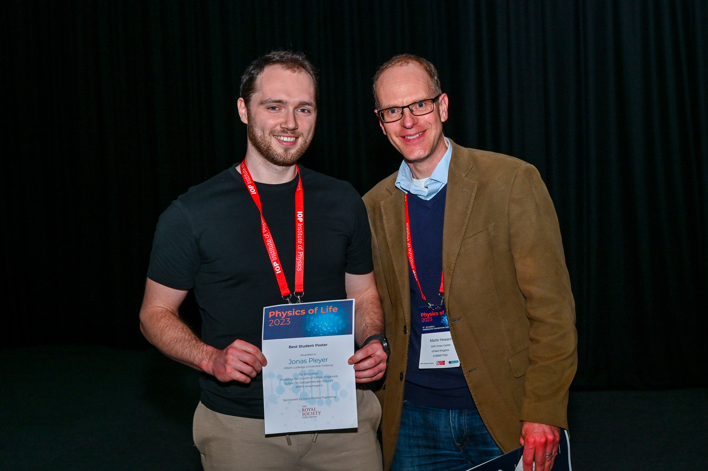

+++
title = 'Physics of Life Conference'
date = 2023-03-31T11:54:00+02:00
post_image = "physics-of-life-logo-cropped.jpg"
tags = ['Biology', 'Math', 'Science', 'Physics']
# TODO
description = "I was at the physics of life conference this week"
+++

This week I had the opportunity to participate at the [Physics of Life conference](https://www.physicsoflife.org.uk/physics-of-life-2023.html) in Harrogate (UK). The conference covers a wide variety of subjects, ranging from single cells, tissues to evolution to name just a few. While the way from Freiburg to Harrogate can be challenging, we got there eventually and checked in at our hotel. The conference was organized very nicely finding a good balance between longer keynotes with many details and shorter talks in separate sessions which were held under a particular topic (eg. Differentiation and development) and coffee breaks in between. Apart from listening to other people and enjoying their work early career researchers as myself were especially encouraged to participate, ask questions and engage in the conversation. I truly enjoyed the atmosphere that was thereby created.

The conference also presented a good opportunity to show some of my current work. I am part of the [CyGenTiG](https://cygentig.ethz.ch/) project which is funded by the European Horizon initiative. In this project, researchers from Edinbourgh, Basel, Düsseldorf and Freiburg work together on optogenetic cellular systems and their control. My task consists of setting up a model to describe the experimental setup of our collaborators.

The poster (see file below) which I presented tries to tackle a current problem in the development of kidney organoids in which they are missing a fully developed ureter duct. It was shown that BMP4 is a morphogen able to fix this behaviour but also leads to diminished branching in nephrogenesis [1]. To avoid the exposure of BMP4 on the nephrons but still realize it for development of the ureter duct, we require a non-trivial spatial distribution of BMP4 morphogens. Scientists are now able to engineer cells which can secrete BMP4 when being exposed to the correct light-source [2].

In this very simplistic model we present a system which is made up of two distinct cell types. The first type represents the just introduced sender cells while the second are cells of the developing organoid. In this model, we can control the light intensity and thus indirectly the gradient of BMP4 morphogen. In a purely computational model it is possible to read out the intracellular concentration of BMP4 in the organoid. Thus we can regulate the sender cells optogenetically in such a way that a certain setpoint is achieved robustly. It is now possible to study many different aspects ranging from exposure type (difference between frequency or intensity modulation), spatial configuration of the experimental setup and many more.

The aforementioned setup is currently not being realized in experiments. However, other aspects such as cell density in certain areas of the simulation is experimentally accessible. I also presented some last-minute results in which I use a vertex-like model in which each cell-agent is still free and does not share vertices with other agents.

My poster was selected from roughly 300 and awarded one of the “Best Student Poster” prizes.

## References

[1] Mills CG, Lawrence ML, Munro DAD, Elhendawi M, Mullins JJ, Davies JA. Asymmetric BMP4 signalling improves the realism of kidney organoids. Sci Rep 2017;7:14824. https://doi.org/10.1038/s41598-017-14809-8.

[2] Humphreys PA, Woods S, Smith CA, Bates N, Cain SA, Lucas R, et al. Optogenetic Control of the BMP Signaling Pathway. ACS Synth Biol 2020;9:3067–78. https://doi.org/10.1021/acssynbio.0c00315.

    <object
        width="100%"
        height="100%"
        data="poster.pdf">
    </object>

