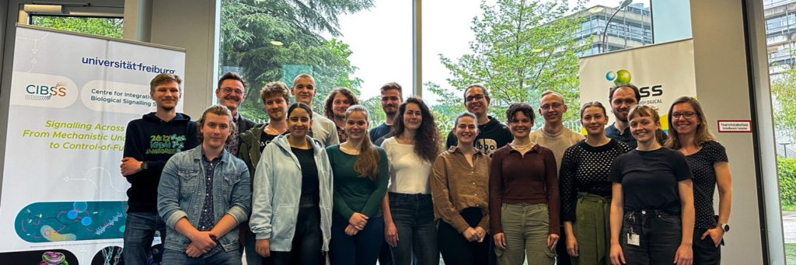

+++
title = 'iGEM 2023'
date = 2023-05-13T20:36:00+02:00
post_image = "IGEM_logo.png"
tags = ['Biology', 'Math', 'Science']
+++

I am excited to share that I will be participating in this years iGEM competition as a supervisor. I will advise the students’ who are modeling their experimental setup. We aim to establish a concise model and acquire relevant parameters in a timely manner. This will probably be a more demanding task than initially believed That being said, the iGEM Freiburg Team is very motivated and I hope to be sharing more details in the coming months.

