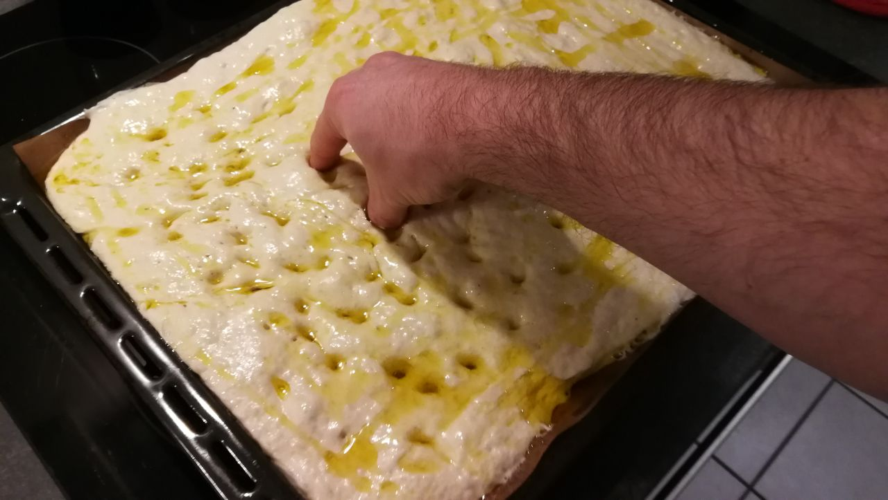

+++
title = 'Mein geheimes Focaccia Rezept'
date = 2023-11-10T17:00:00+02:00
post_image = "photo_1_2023-11-10_23-30-05.jpg"
tags = ['Personal']
+++

In der letzten Zeit wurde ich immer öfter nach meinem Focaccia-Rezept gefragt.
Damit ich in der Zukunft nicht jedes Mal alles von vorne beschreiben muss kommt hier jetzt die
vollständige Anleitung.
Das Rezept ist gut für Anfänger geeignet und kann aber je nach Belieben echt ganz einfach angepasst
werden.

## Zutaten

- 1kg Weizenmehl (Typ 405 oder 550, Dinkelmehl geht auch)
- 800g Wasser
- 1 Block frische Hefe
- 20g Salz
- Olivenöl
- Gewürze



Wasser, Hefe und Salz vermischen und danach mit dem Mehl in einer Schüssel zu einem glatten Teig
kneten.

    
    
    

Den Teig ein wenig mit Olivenöl bedecken und soweit möglich an den Seiten zwischen Teig und Schüssel
bringen.
Das wird dafür sorgen, dass der Teig später nicht so sehr an der Schüssel klebt und sich sehr
einfach ablösen lässt.



Anschließend ruht der Teig für ca. 20 Minuten unter einem Handtuch.
Das hängt allerdings stark von der Temperatur ab.
Das Wichtigste ist, dass sich das Volumen des Teigs in etwa auf das 1,5-fache vergrößert hat.



Jetzt können wir den Teig aus der Schüssel auf ein Backblech “gießen”.
Gut verteilen, sodass das Blech gleichmäßig bedeckt ist und keine Sorge, wenn man dabei ein wenig
an dem Teig herumdrücken muss.



Nun bedecken wir die Oberfläche des Teiges mit Olivenöl, indem wir feine Bahnen längs und quer
ziehen.
Der Teig darf ruhig einiges an Öl abbekommen.
Schwimmen muss er aber auch nicht.
Es ist ganz normal, dass sich dabei kleine “Pfützen” an Öl auf der Oberfläche und den Rändern
bilden.



Anschließend drücken wir die Oberfläche des Focaccia mit unseren Fingern ein, sodass viele kleine
Muldel entstehen.
Ich verwende dabei immer die ganze Hand und mache davor meine Fingerspitzen mit Olivenöl voll, damit
der Teig nicht kleben bleibt.

    
    

Danach kommen die Gewürze drauf.
Salz, Pfeffer und Oregano sind Pflicht.
Alles andere darf gerne individuell angepasst werden.



Zuletzt kann man noch in die entstandenen Löcher kleine (Cherry-) Tomaten setzen.
Es bietet sich an, diese leicht einzudrücken in den Teig, sodass sie nicht komplett an der
Oberfläche sind.



Jetzt können wir das Focaccia endlich in den Ofen geben.
Ich heize ihn vor auf ca. 200°C aber die genaue Temperatur wird sich von Ofen zu Ofen leicht
unterscheiden.
Nach ca. 40 Minuten (muss normalerweise nicht gewendet werden) sollte das Focaccia fertig sein.
Wenn zuerst die Oberseite des Focaccia noch ein kleines bisschen hart ist, macht das gar nichts.
Es wird schnell wieder aufweichen.

Ich wünsche viel Spaß beim ausprobieren und nachbacken und würde mich über ein Bild von dem fertigen
Produkt freuen.
