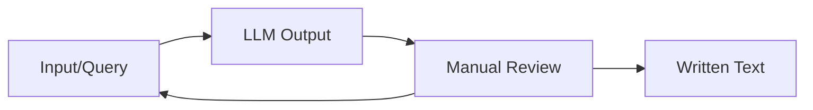

+++
title = 'Writing Scientific Papers with ChatGPT'
date = 2025-07-29
description = "I am very sceptical about the usgae of LLMs. In this post, I explore some of my own experiences with using ChatGPT to assist me in writing academic texts."
post_image = "ChatGPT_logo.png"
tags = ['Science', 'Paper']
draft = true
mermaid = true
+++

I have to preface this post with stating that I am very sceptical about the usage of LLMs to quickly
write (probably any) texts.

I think we have all seen and possibly even tested by ourselves how quickly tools such as ChatGPT
provide answers to even some of the more complex questions.
This is what makes them appealing to a lot of people.
But I care a lot about about quality rather than quantity and this is where my scepticism towards
said tools comes from.

I am the kind of guy that does not really like to write a lot of text.
My main desire is to accomplish technical tasks but not to talk about it.
And so, when I was writing a paper about [rod-shaped bacteria](), I was often thinking about using
ChatGPT in order to quickly "get it done".
But although the desire was there, I did not pull the trigger and did not use it for my initial
writing attempts. 
But at some point feedback became important to me.
While I would be able to send the text to some of my colleagues for review, It would take them quite
some time to come back to me and also put the burden on them.
I value their feedback quite a lot but maybe there are some tasks such as simply identifying
repeating words or awkward formulations which are not so much content-specific but rather a question
of wording that could be done more quickly by a tool such as ChatGPT.
I was also curious how well it would perform for some of my tasks.

# My Principle
I have one firm principle which I do not violate.

> I create my own mistakes and I alone am responsible for them.

This means in particular that I do not blindly copy text which is being generated by the LLM which
clearly takes away responsibility from the LLM and places it back in my hands.
Everything which is being written comes from my keyboard and not any other place.
I would also not copy the work of anyone else and simply rewrite it and insert it as that would be
[plagiarism](https://en.wikipedia.org/wiki/Plagiarism).
If I do present someones work, I will follow the standard procedures for publication that every
scientist is being taught.

But being influenced by external factors does not have be entirely bad.
And in using ChatGPT, I certainly invite myself to be influenced by its output.
So I still use the generative part but only to gather impressions that I can take into
consideration.
If I like a particular word or construction of sentence, then I might use parts of it.
If the LLM adds text in a particular area where I would not have done so myself, I might check if
there is anything behind that text and if I have overlooked some interesting publications for
example.
If I decide that I want to incorporate this new information into my text, I look for credible,
citable sources and add their contents instead of the results produced by the LLM.

It is my firm belief that tools are simply tools and it depends on us in how we use them.
We as a human civilization have always known methods which can both inflict harm and create good
(knives, atomic bomb/nuclear power plants, etc.).
However, as history has shown us, it was always necessary to find some form of agreement which
regulates the use of these tools, either between nations of between people to ensure order and avoid
misuse.

> I basically use ChatGPT as a fancy search engine that I can interact with.

# Case Studies
Let's look at some examples.
Where possible, I will provide the complete query and result.

## Shortening Text
In general, shorting of text works quite okay.
I am often not particularly fond of the style of writing that ChatGPT tends to introduce but in
general it provides me with some variations in formulation that I appreciate.
However, sometimes it hallucinates, thus producing incorrect results such as in the example below.
Unfortunately this was one of my earlier attempts and I was not able to reproduce the precise query
that I gave.
These are the relevant parts.

**Input** 

[..] Rod-shaped bacteria can grow by extending their circular part, or by inserting new material
at the tip of the rod. Species such as E.coli and B.subtilis (Errington and Aart 2020) fall under
the first category while S.pombe represents the latter. [..]

**Output** 

Recent studies have reshaped our understanding of bacterial shape retention, revealing that
rod-shaped bacteria like E. coli and B. subtilis grow through extensions or new material insertion
at the rod tips [..]

**Conclusion** 
The input text states that there are 2 mechanisms by which cells can grow:

1. Insert Material along the Rod
2. Insert Material at the tip

_E.coli_ and _B.subtilis_ use the first mechanism but in the output, this is washed away, thus
giving the impression that _E.coli_ could grow by inserting material at its tip which is not
correct.
This subtle change would probably not be detected by a hasty brush-over.
But it might be recognized when writing the text explicitly by yourself (since you should be the
expert after all).
This further cemented [my principle](#my-principles).

## Summarizing Papers

## Writing an Introduction
