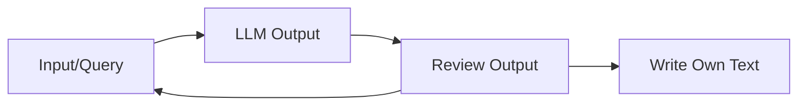

+++
title = 'Writing Scientific Papers with ChatGPT'
date = 2025-10-18
description = "I am very sceptical about the usgae of LLMs. In this post, I explore some of my own experiences with using ChatGPT to assist me in writing academic texts."
post_image = "ChatGPT_logo.png"
tags = ['Science', 'Paper']
mermaid = true
aliases = ['/posts/2025-18-10-writing-papers-with-chatgpt/']
+++

I have to preface this post with stating that I am very sceptical about the usage of LLMs to quickly
write (probably any) texts.

I think we have all seen and possibly even tested by ourselves how quickly tools such as ChatGPT
provide answers to even some of the more complex questions.
This is what makes them appealing to a lot of people.
But I care a lot about about quality rather than quantity and this is where my scepticism towards
said tools comes from.

I am the kind of guy that does not really like to write a lot of text.
My main desire is to accomplish technical tasks but not to talk about it.
And so, when I was writing a paper about
[rod-shaped bacteria](https://github.com/jonaspleyer/cr_mech_coli/), I was often thinking about
using ChatGPT in order to quickly "get it done".
But although the desire was there, I did not pull the trigger and did not use it for my initial
writing attempts. 
But at some point feedback became important to me.
While I would be able to send the text to some of my colleagues for review, It would take them quite
some time to come back to me and also put the burden on them.
I value their feedback quite a lot but maybe there are some tasks such as simply identifying
repeating words or awkward formulations which are not so much content-specific but rather a question
of wording that could be done more quickly by a tool such as ChatGPT.
I was also curious how well it would perform for some of my tasks.

# My Principle
I have one firm principle which I do not violate.

> I create my own mistakes and I alone am responsible for them.

This means in particular that I do not blindly copy text which is being generated by the LLM .
In doing so, it takes away the control and responsibility from the LLM and places it back in my
hands where it belongs.
Everything which is being written comes from my keyboard and not any other place.
I would also not copy the work of anyone else and simply rewrite it and insert it as that would be
[plagiarism](https://en.wikipedia.org/wiki/Plagiarism).
If I do present someones work, I will follow the standard procedures for publication that every
scientist is being taught.

> I basically use ChatGPT as a fancy search engine that I can interact with.

But being influenced by external factors does not have to be entirely bad.
And in using ChatGPT, I certainly invite myself to be influenced by its output.
So I still use the generative part but only to gather impressions that I can take into
consideration.
If I like a particular word or construction of sentence, then I might use parts of it.
If the LLM adds text in a particular area where I would not have done so myself, I might check if
there is anything behind that text and if I have overlooked some interesting publications for
example.
If I decide that I want to incorporate this new information into my text, I look for credible,
citable sources and add their contents instead of the results produced by the LLM.

# Case Studies

## Shortening Text
In general, shorting of text works quite okay.
I am often not particularly fond of the style of writing that ChatGPT tends to introduce but in
general it provides me with some variations in formulation that I appreciate.
However, sometimes it hallucinates, thus producing incorrect results such as in the example below.
Unfortunately this was one of my earlier attempts and I was not able to reproduce the precise query
that I gave.
These are the relevant parts.

**Input & Output** 

[..] Rod-shaped bacteria can grow by extending their circular part, or by inserting new material
at the tip of the rod. Species such as E.coli and B.subtilis (Errington and Aart 2020) fall under
the first category while S.pombe represents the latter. [..]

 

Recent studies have reshaped our understanding of bacterial shape retention, revealing that
rod-shaped bacteria like E. coli and B. subtilis grow through extensions or new material insertion
at the rod tips [..]

**Conclusion** 
The input text states that there are 2 mechanisms by which cells can grow:

1. Insert Material along the Rod
2. Insert Material at the tip

_E.coli_ and _B.subtilis_ use the first mechanism but in the output, this is washed away, thus
giving the impression that _E.coli_ could grow by inserting material at its tip which is not
correct.
This subtle change would probably not be detected by a hasty brush-over.
But it might be recognized when writing the text explicitly by yourself (since you should be the
expert after all).
This further cemented [my principle](#my-principles).

## Writing an Introduction
I had written some notes for an introduction to a paper.
They were already in the form of many individual paragraphs that did not really fit well together or
flow at all.
Furthermore, it was too much information to be used in total.
To give you an estimate: The original text contained $\approx 9200$ words.
I do not want to provide the whole text here for two reasons:
First, I do not know where this paper will be published and under which license the resulting
contents may be released.
Secondly, the following example is understandable without the full text.

**Input & Output** 

I have an existing introduction for my paper and want to rewrite it completely.
I will first give you my existing text and afterwards some bullet points for what to include in the
re-write.

[..Existing Text..]

 

Great, thanks for sharing your existing introduction!
Please go ahead and give me your bullet points for what you’d like included in the re-write, and
I’ll draft you a fully new version that’s smoother, more structured, and tailored to your goals.

 

Bullet points for new text:

[..]
- challenge: estimate their parameters
- challenge: construct minimal models (requires flexibility)

[..]

 

Perfect, thanks for the bullet points. Based on these, here’s a completely rewritten introduction
that integrates your intended structure and flow.
I’ve reorganized it so that it moves from general issues with ABMs → motivation → experimental
background on rod-shaped bacteria → computational studies → your contribution.

 

Draft of New Introduction

[..]

Despite their popularity, ABMs face two persistent challenges: parameter estimation and model
construction.

[..]

This raises concerns about the biological validity of many models.
At the same time, there is a tension between building models that are sufficiently flexible to
capture essential phenomena and keeping them minimal enough to remain interpretable and
computationally tractable.

[..]

My overall critique of the generated code would be:
- Flows very well while simply reading through it.
- Links concepts at points where they do not necessarily make sense
- It picked up some interesting points which I had not previously workout out explicitly.
- Shallow in depth

And this critique is illustrated by the example above.
The bullet point about "construction of minimal models" refers to the fact that ABMs _can_ construct
models for particular cells but they are often too large with too many parameters (a problem that
AI-adventurers should be aware of as well).
The fact that the word "minimal" is here, is crucial and should not be omitted.
Since the result does not contain it anymore, it is simply wrong.

The second part of the output worked out another point which was hidden within my original text and
not formulated very clearly.
While it is true that these kind of thoughts are of more general nature and can be true for any
field of study, I was still surprised that the LLM could pick it up and formulate it this clearly.
I will definitely use this part as inspiration.
I also like that it is formulated in a soft tone, meaning that it does not bluntly state that "ABMs
are over-parametrized" but rather notes "This raises concerns about the validity ...".

# Conclusion

In general, I am very worried about the overall state of this field.
While I cannot comment about the business-side of things, I think that tools such as ChatGPT have
the potential to further contribute to the overall shallowness of our society and interactions.
I truly dislike this direction.

As a scientist and software engineer, it is clear that tools are just tools and it depends on how we
use them.
We have seen an
[increase](https://scholarlykitchen.sspnet.org/2024/03/20/the-latest-crisis-is-the-research-literature-overrun-with-chatgpt-and-llm-generated-articles/)
in the number of articles that are written by LLMs such as ChatGPT.
And when the results become obvious, it really shows and leaves a bad smell.
It is one more thing on the list of bad practices that is already prevalent in scientific
publishing.
It discredits the work of any reliable and faithful researcher that diligently does their work and
might not get recognized for their useful contributions.

But it is also a matter of how we advertise them, how we market them to particular target audiences
and how we educate our population to deal with them.
These are all problems which the world has seen before in the form of the internet, smartphones and
social media.
However, the burden of dealing with them mainly falls back onto the end-users, leaving the big
corporations without any moral obligations towards them.
This same principle has lead to
[controversies and problems](https://en.wikipedia.org/wiki/Facebook#Criticisms_and_controversies)
before and going down this route again would mean that we have not learned from the past at all.
In a perfect world, we would find the incentives which are good and keep big corporations in check
without having to rely on bans, restrictions or other legal means.

> I do not know the answer, but the impact which these tools can have on our society is too big to
ignore it and certainly too big to experiment with it, even in the short term.

It is my firm belief that tools are simply tools and it depends on us in how we use them.
We as a human civilization have always known methods which can both inflict harm and create good
(knives, atomic bomb/nuclear power plants, etc.).
However, as history has shown us, it was always necessary to find some form of agreement which
regulates the use of these tools, either between nations of between people to ensure order and avoid
misuse.

 

_PS_ I recently saw this video
https://www.youtube.com/watch?v=4ys3Z7_5nn8
which really resonated with my own views.
