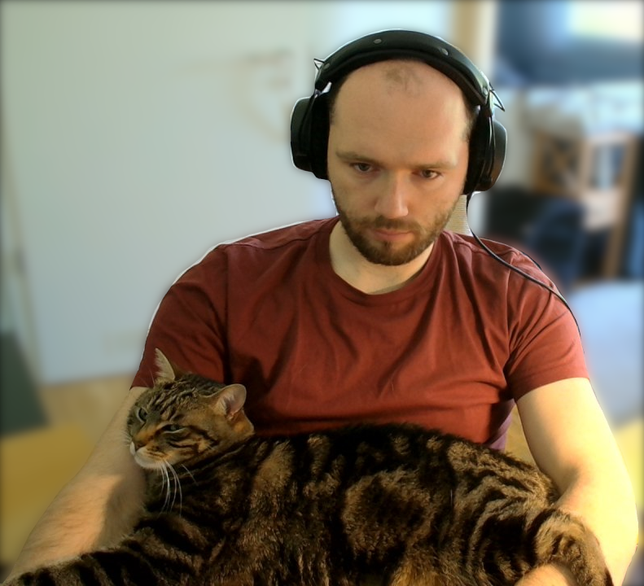

+++
title = 'niri is great'
date = 2026-04-01
post_image = "niri-logo.svg"
tags = ['Science', 'Paper']
link = "github.com/niri-wm/niri"
link_url = "https://github.com/niri-wm/niri"
+++

I have recently discovered `niri`, a scrollable-tiling compositor for wayland and I really like its
design and handling.
However, as with any new technology there are some caveats.

## Introduction

I have to start off by mentioning that I have tried various desktop environments and compositors
over the past years.
Since I run archlinux, it is very easy and convenient for me to change between these different
solutions.
So far I have tested Gnome, [`i3`](https://wiki.archlinux.org/title/I3),
[Hpyrland](https://wiki.archlinux.org/title/Hyprland),
[LXDE](https://wiki.archlinux.org/title/LXDE),
[LXQt](https://wiki.archlinux.org/title/LXQt)
and [KDE](https://wiki.archlinux.org/title/KDE).
While I am aware that this list is a mixture of compositors and Desktop Environments (DEs), my focus
for this blog post is not going to be on the technical details but rather on the practical usage.

To cut the discussion on these different tools short, I have mainly used my trusted KDE setup on my
personal, work, mobile and workstation devices and I have been very pleased with the overall
experience.
At the time of introduction, I was an early adopter of `plasma-5.0` with which I had quite a lot of
difficulties in getting started - probably in great part due to my NVIDIA graphics card.
During this time I often had the urge to try new DEs but I always came crawling back to my trusted
companion: KDE.

## My special use-case for `niri`

I have a cat .. A cat with a great desire for close comfortable cuddles.
This means that she particularly prefers if I can keep my hands in a static position, most favorably
at the keyboard.
Even now that I am writing this text, she is with me and requires my attention.

But the position displayed in the image is only part of the story.
She will often lay on my arms very deliberately - almost as if to stop me from working.
It is of course my great pleasure to have her with me all this time and I wish to satisfy her needs
as well as mine.

And this is where `niri` comes in.

Just as `neovim` allows me to avoid using the mouse, `niri` achieves the same when managing windows.
I really enjoy, being able to control all windows with the keyboard.
One could argue that `i3` solves a similar problem and it is true.
But what I really did not enjoy about it was that control of the layout seemed very hard and I
simply could not figure out how to properly control it.
Since all windows are always crammed onto one single monitor, there will eventually be a problem
when you open too many of them.

To my personal taste, `niri` solves this problem wonderfully.
The default shortcuts are very intuitive and I only made very minor tweaks to the default config.
In addition to niri, I use the [`dms-shell`](https://archlinux.org/packages/extra/x86_64/dms-shell/)
which provides a nice bar and launcher.

I am aware, that KDE also has some functionality and plugins for tiling solutions but it is not
baked into the DE and further lacks horizontal scrolling.
I also use the quick-tile features provided by kwin and I am overall very happy with them.

Another selling point for me is the speed at which `niri` operates.
Switching between workspaces is lightning fast and I extremely enjoy the responsiveness for window
resizing.
This is something that I care about quite a bit.
I also use gaming monitors with 170Hz refresh rate just to have quick response times and buttery
smooth animations.

## The caveats

The `niri` compositor is quite new in the scene and as with any novel project, some desired features
may not yet be available.
For instance, monitor mirroring is simply not implemented.
One can achieve it by using
[`wl-mirror`](https://man.archlinux.org/man/extra/wl-mirror/wl-mirror.1.en) but it is definitely a
workaround and not a permanent solution and also requires much more resources, thus consuming more
power.

I personally also wish to have a functionality where workspaces are not tied to a particular monitor
but rather where workspaces behave a bit more similarly to the ones in KDE plasma.
There changing a workspace affects all monitors simultaneously.
I prefer this version since this allows me to allocate certain workspaces to particular tasks.
For instance, I might have one workspace reserved for communication (mail, chats, etc.), one for
programming and one for writing.
In `niri`, this is only possible if all of these windows are also on a single monitor.

## Conclusion

I will continue to experiment and use `niri` for my daily tasks but will also keep KDE plasma as a
fallback for important things such as presentations.
But I am excited about its future and could see myself using it as a daily driver for years to come
if the project grows and implements some of my desired features.
