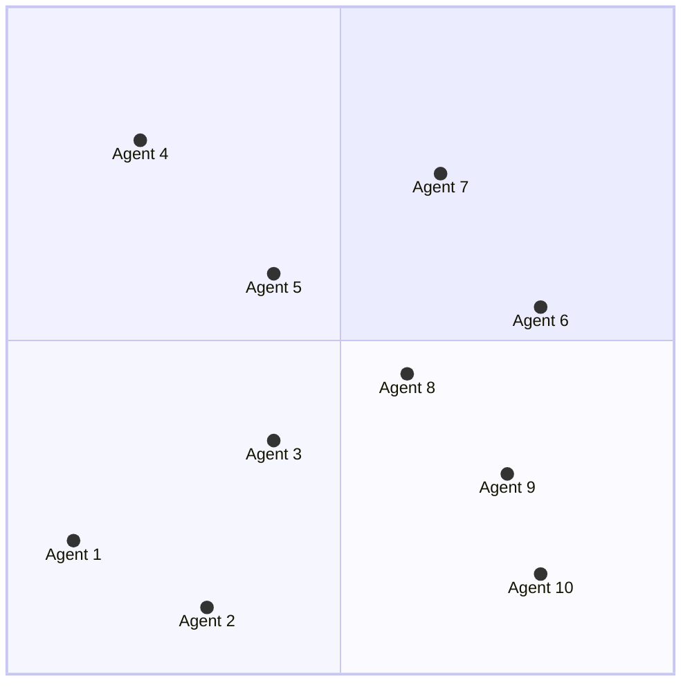

+++
title = 'Spatial Decomposition'
date = 2025-03-14
link = "https://github.com/jonaspleyer/spatial-decomposition"
link_display = "github.com/jonaspleyer/spatial-decomposition"
post_image = "square10.png"
tags = ['Rust']
description = "A Rust crate which can decompose given rectangles into subdomains depending on different criteria. It implements the Kong-Mount-Roscoe (KMR) decomposition"
mermaid = true
+++

During the development of [`cellular_raza`](/publications/2025-06-cellular_raza), I came across the
concept of [domain decomposition](https://en.wikipedia.org/wiki/Domain_decomposition_methods), which
allows to split a certain problem into multiple sub-tasks such that they can be processed in
parallel for faster overall execution.


These algorithms often target systems such as large linear equations or spatial problems.
In order to obtain correct results, boundary values and conditions must be communicated between
sub-tasks.
Within `cellular_raza`, I was mainly concerned with calculating interactions between agents.
We can assume that all interactions are of finite range and can thus group agents which are nearby
to each other into the same subdomain.
Our goal is to optimize the overall computational time of our numerical simulation.
From the standpoint of a single subdomain, this consists of multiple factors.

1. Number of neighboring subdomains with which to communicate
2. Number of pairwise interactions between neighboring subdomains
3. Pairwise interactions within a single subdomain
4. Exchange of agents between subdomains

The number of subdomains with which any other subdomain has to communicate and the
overall load.
Finally, if not enough agents are placed within a single subdomain, the computational overhead of
communicating with neighboring subdomains will greatly outweigh the time to calculate the
interactions within a single subdomain.

The following plot shows a 4 subdomains which contain agents that can interact with each other.
In this case, each subdomain has 3 neighboring subdomains to communicate with.
The number of pairwise interactions between agents of different subdomains and within a single
subdomain depend on the range of the interaction.
Lastly, the exchange rate of agents between different subdomains is determined by their motility in
space.



The crate which I constructed implements the
[Kong, Mount and Roscoe (KMR)](https://scispace.com/pdf/the-decomposition-of-a-rectangle-into-rectangles-of-minimal-3whu99wjdy.pdf)
algorithm which splits a given rectangle into multiple smaller rectangles and by this minimizes
their individual perimeters.
The algorithm is inherently 2D and can thus not be easily applied to 3-dimensional simulations.

```rust
use spatial_decomposition::{kmr_decompose, Rectangle};

let domain = Rectangle {
    min: [0., 40.],
    max: [100., 240.],
};

let n_subdomains = 9;
let subdomains = kmr_decompose(&domain, n_subdomains.try_into().unwrap());

assert_eq!(subdomains.len(), 9);

for subdomain in subdomains {
    // ...
}
```
